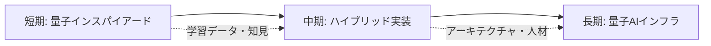

# 第2弾：AIを高度化するのが量子コンピュータ、という考え方

## この記事で分かること

- 量子コンピュータを「AI高度化装置」として捉える戦略的視点
- 現代AIが抱える本質的な限界と、量子技術による突破口
- 今日から始められる3段階の実装ロードマップ
- 技術者・事業家が今すぐ着手すべき具体的アクション

## はじめに：量子コンピュータの「位置づけ」を変える

「量子コンピュータはAIを高度化する装置である」——この一文を軸にすると、ビジネス戦略が変わります。

先日の投稿で「量子業界は今を語れない」と書いたところ、多くのエンジニアや経営者の方から反応をいただきました。量子技術はまだ「未来の話」として語られがちで、現場のエンジニアにとっては「今、何をすればいいのか」が見えにくい領域です。

しかし、量子コンピュータを**AIの限界を突破するための技術**として位置づけると、話は変わります。これは遠い未来の話ではなく、今日から準備を始めるべき、連続したロードマップになるのです。

本記事では、私が事業開発の現場で実際に使っている「3段階フレームワーク」を、技術的背景とビジネス戦略の両面から解説します。

## 現代AIが抱える根本的な限界

### データと電力の暴力的消費

現在のディープラーニングは、膨大なデータと電力を使って「それらしい答え」を生成しています。GPT-4やGeminiのような大規模言語モデル（LLM）は数千億のパラメータを持ち、学習には数百万ドル規模の計算リソースが必要です。

```python
# 典型的なLLMの推論プロセス（概念図）
def ai_inference(input_data):
    # 膨大なパラメータ空間を探索
    for layer in neural_network:
        input_data = layer.forward(input_data)
    # "それらしい"答えを確率的に生成
    return softmax(input_data)
```

しかし、この「力技」には限界があります。

### 組み合わせ爆発という壁

特に問題になるのが、**組み合わせ最適化問題**です。

- **物流の配送ルート最適化**：配送先が30カ所あるとき、可能な経路は30!(約2.65×10^32)通り
- **創薬のタンパク質折りたたみ問題**：100個のアミノ酸配列の取りうる構造は天文学的
- **金融ポートフォリオ最適化**：数千の銘柄から最適な組み合わせを選ぶ

これらの問題では、古典コンピュータは「全探索」も「近似解法」も本質的に限界があります。AIは学習データから「パターン」を見つけることは得意ですが、**未知の組み合わせ空間を効率的に探索すること**は苦手なのです。

## 量子コンピュータがAIの何を変えるのか

### 量子的な探索の優位性

量子コンピュータは、**重ね合わせ**と**エンタングルメント**により、複数の解候補を同時に評価できます。

```python
# 量子的な探索のイメージ（疑似コード）
def quantum_search(search_space):
    # 全状態の重ね合わせを作る
    superposition = create_superposition(search_space)
    
    # 量子干渉で「正解」を増幅
    for iteration in range(sqrt(N)):  # 古典O(N)が量子O(√N)に
        amplitude_amplification(superposition)
    
    # 測定で最適解を取得
    return measure(superposition)
```

この**二次的速度向上**（Groverのアルゴリズム）や、最適化問題における**指数的速度向上**の可能性（Shorのアルゴリズム、変分量子固有値法など）が、AIの探索空間を根本的に変えます。

### AIと量子の融合領域

具体的には、以下の領域で融合が進んでいます。

| 領域 | 古典AIの課題 | 量子の貢献 |
|------|------------|----------|
| 特徴量空間の拡張 | 高次元データの表現力不足 | 量子カーネル法による指数的次元拡張 |
| 最適化問題 | 組み合わせ爆発 | QAOA等による効率的探索 |
| サンプリング | モンテカルロ法の収束遅さ | 量子サンプリングによる高速化 |
| パラメータ最適化 | 勾配消失問題 | 量子変分回路による新たな最適化空間 |

## 今日から始める3段階ロードマップ

ここからが実践編です。私は量子×AI事業を3段階で考えています。

### 【短期・今すぐ】量子インスパイアード戦略

> 「量子の考え方をAIに応用する。量子コンピュータがなくてもできる。今日から着手できる。」

**具体的なアプローチ：**

#### 1. Simulated Annealing（シミュレーテッドアニーリング）

量子アニーリングの考え方を古典コンピュータで模倣する手法です。

```python
import numpy as np

def simulated_annealing(cost_function, initial_state, temperature=100):
    """量子インスパイアードな最適化"""
    current = initial_state
    current_cost = cost_function(current)
    
    for step in range(10000):
        # 温度を徐々に下げる（量子的なトンネル効果を模倣）
        T = temperature * (0.999 ** step)
        
        # 近傍解を生成
        neighbor = generate_neighbor(current)
        neighbor_cost = cost_function(neighbor)
        
        # メトロポリス基準で受理判定
        if accept_probability(current_cost, neighbor_cost, T) > np.random.random():
            current = neighbor
            current_cost = neighbor_cost
    
    return current
```

**実装例：**
- ECサイトの在庫配置最適化
- シフトスケジューリング
- 広告配信の組み合わせ最適化

これらは**今日からPythonで実装可能**で、ROIも見えやすい領域です。

#### 2. テンソルネットワークの活用

量子状態の記述に使われるテンソルネットワークを、古典的なデータ圧縮や推薦システムに応用する研究が進んでいます。

### 【中期・3〜5年】量子ハードウェアとの部分統合

量子コンピュータの実用性が高まる領域から、既存AIと組み合わせた実装を始めるフェーズです。

**注目すべき技術領域：**

#### 1. Variational Quantum Eigensolver (VQE)

化学シミュレーションや材料科学で、古典コンピュータと量子コンピュータをハイブリッドで使う手法です。

```python
# VQEのハイブリッドアーキテクチャ（概念）
def vqe_loop(hamiltonian, quantum_circuit):
    # 古典オプティマイザがパラメータを更新
    optimizer = ClassicalOptimizer()
    
    while not converged:
        # 量子コンピュータでエネルギー期待値を計算
        energy = quantum_device.measure_expectation(
            quantum_circuit, 
            hamiltonian
        )
        
        # 古典コンピュータで勾配を計算し、パラメータを更新
        gradient = optimizer.compute_gradient(energy)
        quantum_circuit.update_parameters(gradient)
    
    return quantum_circuit
```

**実用化が見込まれる領域：**
- 創薬における分子シミュレーション
- バッテリー材料の設計
- 触媒反応の最適化

#### 2. Quantum Machine Learning (QML) ライブラリの実用化

PennyLane、Qiskit Machine Learning、TensorFlow Quantumなどのフレームワークが成熟し、量子回路をニューラルネットワークの一部として組み込むことが容易になります。

```python
import pennylane as qml
from pennylane import numpy as np

# 量子回路をレイヤーとして扱う
dev = qml.device('default.qubit', wires=4)

@qml.qnode(dev)
def quantum_layer(inputs, weights):
    # 古典データを量子状態にエンコード
    for i, input_val in enumerate(inputs):
        qml.RY(input_val, wires=i)
    
    # 量子回路の学習可能なレイヤー
    qml.templates.StronglyEntanglingLayers(weights, wires=range(4))
    
    # 測定
    return [qml.expval(qml.PauliZ(i)) for i in range(4)]
```

このフェーズでは、**量子クラウドサービス（AWS Braket、Azure Quantum、IBM Quantum）を活用したプロトタイピング**が現実的になります。

### 【長期・5年以降】量子AIインフラの時代

量子AIが産業のインフラになる時代に、プレイヤーとして存在するための準備フェーズです。

**将来像：**
- 量子クラウドが一般的なAPIとして利用可能に
- 量子AI専用チップ（QPU）の普及
- 量子セキュアな分散学習ネットワーク

**今から準備すべきこと：**
1. **人材育成**：社内に量子×AIの基礎知識を持つエンジニアを育成
2. **知財戦略**：量子アルゴリズムの特許出願
3. **エコシステム構築**：大学・研究機関との共同研究体制

## この3段階は連続した一本の道

重要なのは、これらは**別々の戦略ではない**ということです。



短期フェーズで得た最適化問題のドメイン知識が、中期の量子実装設計に直結します。中期で構築したハイブリッドアーキテクチャが、長期のインフラ設計の基盤になります。

「量子は関係ない」と言っている間に、競合はすでに短期フェーズを終えているかもしれません。

## まとめ

- 量子コンピュータは「AIの限界を突破する技術」として位置づけると、戦略が明確になる
- 現代AIは組み合わせ最適化や探索問題で根本的な限界を抱えている
- 量子技術の導入は3段階で考える：①今すぐ（量子インスパイアード）、②3〜5年（ハイブリッド実装）、③5年以降（インフラ化）
- この3段階は連続した道であり、早期着手が長期的優位性を生む

## 次のアクション

あなたの会社・プロジェクトで今日から始められること：

### エンジニア・研究者の方へ
- [ ] Simulated Annealingで自社の最適化問題を解いてみる
- [ ] PennyLaneやQiskitのチュートリアルを試す
- [ ] 量子コンピュータの基礎を学ぶ（推奨書籍：「量子コンピュータが本当にわかる!」）

### 事業責任者・経営者の方へ
- [ ] 自社のAI戦略に「量子」の視点を加える
- [ ] 短期（量子インスパイアード）で成果が出せる領域を探す
- [ ] 大学・研究機関との連携窓口を作る

### スタートアップの方へ
- [ ] 量子×AIの融合領域で「今解ける問題」を見つける
- [ ] 量子クラウド（AWS Braket等）の無料枠で実験を始める
- [ ] 量子技術者のネットワーキングイベントに参加する

**あなたの会社は今、どのフェーズを見ていますか？**

コメント欄で、あなたの取り組みや疑問をぜひシェアしてください。量子×AIの未来を、一緒に作っていきましょう。

---

**著者：高野秀隆**
量子コンピュータ×AI事業家。量子技術の社会実装と、AIの次世代アーキテクチャ構築に取り組む。「今日から始める量子戦略」をテーマに、技術とビジネスの橋渡しを実践中。